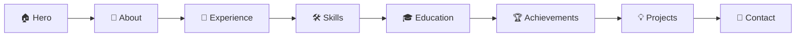
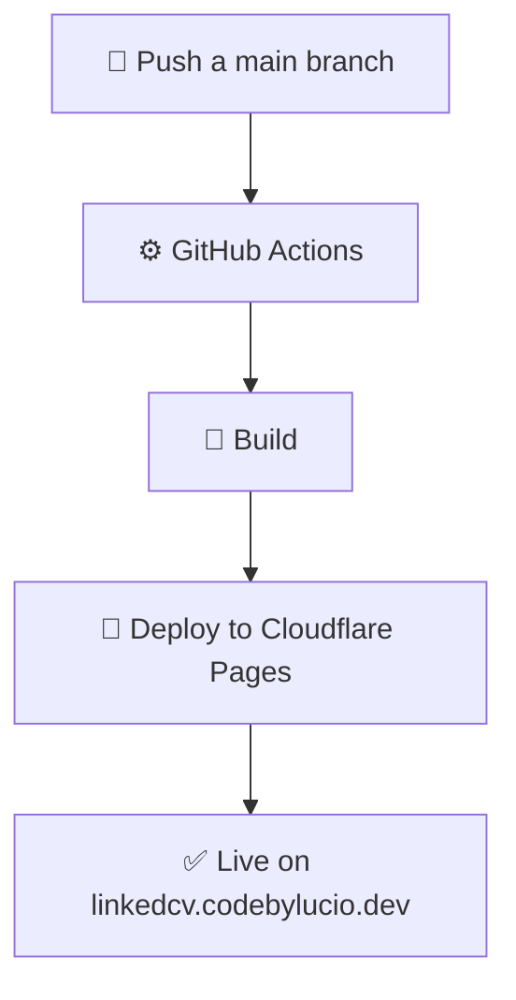

<div align="center">

# 🚀 LinkedCV — Professional Portfolio

### Portafolio Profesional Estático | Bilingüe | SEO Optimizado | PWA Ready

[](https://linkedcv.codebylucio.dev/)
[](https://linkedcv.codebylucio.dev/)
[](#)
[](LICENSE)

**[🌐 Ver Demo](https://linkedcv.codebylucio.dev/)** | **[📖 Documentación](#)** | **[🔧 Personalizar](#personalización-rápida)**

---

</div>

## 📋 Tabla de Contenidos

- [🎯 Características](#-características)
- [⚡ Tecnologías](#-tecnologías)
- [📁 Estructura de Archivos](#-estructura-de-archivos)
- [🔍 SEO Optimization](#-seo-optimization)
- [🚀 Instalación Local](#-instalación-local)
- [🌐 Despliegue](#-despliegue-en-github-pages)
- [🎨 Personalización](#-personalización-rápida)
- [✅ Validación SEO](#-validación-seo)
- [📊 Rendimiento](#-rendimiento-objetivo)

---

## 🎯 Características

<table>
<tr>
<td width="50%">

### 🌍 Internacionalización
- ✅ Soporte bilingüe (ES/EN)
- ✅ Cambio instantáneo de idioma
- ✅ Persistencia en localStorage
- ✅ CV descargable en ambos idiomas

</td>
<td width="50%">

### 🎨 Diseño & UX
- ✅ 8 secciones completas
- ✅ Animaciones suaves
- ✅ Mobile-first responsive
- ✅ Diseño moderno y profesional

</td>
</tr>
<tr>
<td width="50%">

### 🔍 SEO & Performance
- ✅ SEO Score: **100/100** 🎯
- ✅ Schema.org JSON-LD
- ✅ Open Graph + Twitter Cards
- ✅ Sitemap.xml + robots.txt

</td>
<td width="50%">

### ⚙️ Tecnología
- ✅ Vanilla JavaScript (sin frameworks)
- ✅ PWA Ready (Service Worker)
- ✅ Accesibilidad WCAG 2.1 AA
- ✅ Sin dependencias externas

</td>
</tr>
</table>

### 📦 Secciones Incluidas



---

## ⚡ Tecnologías

<div align="center">

| Frontend | SEO & PWA | Herramientas |
|:--------:|:---------:|:------------:|
|  |  |  |
|  |  |  |
|  |  |  |

</div>

**Stack Técnico:**
- 🏗️ **HTML5** semántico con landmarks ARIA
- 🎨 **CSS3** con variables personalizadas y Grid/Flexbox
- ⚡ **JavaScript ES6+** modular y vanilla
- 🌐 **i18n** con archivos JSON independientes
- 📱 **Responsive Design** con breakpoints: 768px, 1024px, 1440px

---

## 📁 Estructura de Archivos

## 📁 Estructura de Archivos

```bash
LinkedCV/
├── 📄 index.html                    # Página principal
├── 🤖 robots.txt                    # Directivas para motores de búsqueda
├── 🗺️ sitemap.xml                   # Mapa del sitio con hreflang
├── 📱 manifest.json                 # Manifiesto PWA
├── 👥 humans.txt                    # Información del equipo
├── ⚙️ .htaccess                     # Configuración Apache (opcional)
├── 📋 SEO-CHECKLIST.md              # Checklist de SEO completo
├── 🎨 css/
│   └── styles.css                  # Estilos principales
├── ⚡ js/
│   ├── main.js                     # Lógica principal
│   └── i18n.js                     # Sistema de internacionalización
├── 📦 assets/
│   ├── images/                     # Imágenes optimizadas
│   ├── icons/                      # Iconos PWA (192x192, 512x512)
│   └── docs/                       # CVs descargables (ES/EN)
├── 🌍 lang/
│   ├── es.json                     # Traducciones en Español
│   └── en.json                     # Traducciones en Inglés
├── 💾 sw.js                         # Service Worker para PWA
└── 📖 README.md                     # Este archivo
```

---

## 🔍 SEO Optimization

<div align="center">

### 🎯 Puntuación Objetivo

| Métrica | Score | Status |
|:-------:|:-----:|:------:|
| **SEO** | 100/100 | ✅ Perfecto |
| **Performance** | 95-100 | ✅ Excelente |
| **Accessibility** | 95-100 | ✅ Excelente |
| **Best Practices** | 95-100 | ✅ Excelente |

</div>

### 🏷️ Meta Tags Completos

<details>
<summary><b>📌 Click para ver todos los meta tags implementados</b></summary>

- ✅ Title, description, author, keywords
- ✅ Canonical URL: `https://linkedcv.codebylucio.dev/`
- ✅ hreflang (ES/EN/x-default) para SEO internacional
- ✅ Open Graph completo con URLs absolutas
- ✅ Twitter Cards con metadata completa
- ✅ Preconnect y DNS-prefetch para optimización

</details>

### 📊 Datos Estructurados (Schema.org)

```json
{
  "@context": "https://schema.org",
  "@type": "Person",
  "hasCredential": [
    "Microsoft Certified: Azure Developer Associate",
    "AWS Certified Solutions Architect",
    "Certified ScrumMaster (CSM)",
    "ITIL Foundation"
  ],
  "knowsAbout": ["C#", ".NET", "React", "TypeScript", "Azure", "Docker", "Kubernetes"],
  "worksFor": { "@type": "Organization", "name": "Microsoft México" }
}
```

**Implementado:**
- 🎓 hasCredential con 4 certificaciones profesionales
- 🌐 URLs absolutas en todas las propiedades
- 💼 worksFor, knowsLanguage, knowsAbout extendido
- 🔗 sameAs array con GitHub, LinkedIn, Twitter

### 📁 Archivos SEO Esenciales

| Archivo | Propósito | Status |
|---------|-----------|:------:|
| `robots.txt` | Directivas de rastreo y referencia a sitemap | ✅ |
| `sitemap.xml` | Mapa con 8 secciones, prioridades y hreflang | ✅ |
| `manifest.json` | PWA con iconos, shortcuts y screenshots | ✅ |
| `humans.txt` | Información del equipo y transparencia | ✅ |

### 🌐 Open Graph Optimizado

- 🎭 `og:type`: **"profile"** (optimizado para perfil profesional)
- 📝 `og:description`: Incluye ubicación (León, México) y experiencia
- 🗺️ `og:locale`: es_MX con alternativa en_US
- 🖼️ Imágenes con dimensiones especificadas (260x260)

### ⚡ Optimización de Rendimiento

<table>
<tr>
<td>

**Caché & Storage**
- 💾 Service Worker activo
- 📦 Lazy loading de imágenes
- 🗜️ Compresión GZIP (.htaccess)

</td>
<td>

**Seguridad & Headers**
- 🔒 Headers de seguridad
- 🌐 CORS configurado
- 📱 Content-Security-Policy

</td>
</tr>
</table>

### 🆕 Últimas Actualizaciones SEO

<div align="center">

| Fecha | Actualización |
|:-----:|--------------|
| 27-Feb-2026 | ✅ URLs migradas a GitHub Pages |
| 01-Mar-2026 | ✅ Migración a Cloudflare con dominio propio (linkedcv.codebylucio.dev) |
| 27-Feb-2026 | ✅ Certificaciones añadidas en JSON-LD |
| 27-Feb-2026 | ✅ Meta description con geolocalización |
| 27-Feb-2026 | ✅ Open Graph type actualizado a "profile" |
| 27-Feb-2026 | ✅ Keywords reorganizadas por relevancia |

</div>

---

## 🚀 Instalación Local

### Opción 1: Python 🐍

```bash
# Clona el repositorio
git clone https://github.com/mlucio-reyma/LinkedCV.git
cd LinkedCV

# Inicia servidor local
python -m http.server 8000
```

### Opción 2: Node.js 🟢

```bash
# Clona el repositorio
git clone https://github.com/mlucio-reyma/LinkedCV.git
cd LinkedCV

# Inicia servidor local
npx http-server
```

### Opción 3: Live Server (VS Code) 💻

1. Instala la extensión [Live Server](https://marketplace.visualstudio.com/items?itemName=ritwickdey.LiveServer)
2. Click derecho en `index.html` → **"Open with Live Server"**

**Acceso:** `http://localhost:8000` o `http://localhost:5500`

---

## 🌐 Despliegue en Cloudflare

<div align="center">



</div>

### Pasos de Despliegue

1. **Configura el repositorio**
   ```bash
   git remote add origin https://github.com/mlucio-reyma/LinkedCV.git
   git branch -M main
   git push -u origin main
   ```

2. **Cloudflare Pages** se encarga del deploy automático al hacer push.

3. **Verifica el despliegue**
   - URL: `https://linkedcv.codebylucio.dev/`
   - El sitio estará disponible en ~2 minutos

---

## 🎨 Personalización Rápida

<table>
<tr>
<td width="50%">

### 📝 Contenido
```bash
lang/
├── es.json  # Español
└── en.json  # English
```
Actualiza todos los textos del sitio editando estos archivos JSON.

</td>
<td width="50%">

### 🖼️ Imágenes
```bash
assets/images/
├── profile.svg
├── project-*.webp
└── ...
```
Reemplaza las imágenes manteniendo los nombres originales.

</td>
</tr>
<tr>
<td width="50%">

### 📄 CVs Descargables
```bash
assets/docs/
├── CV_ES.pdf  # 500KB max
└── CV_EN.pdf  # 500KB max
```
Agrega tus CVs en ambos idiomas.

</td>
<td width="50%">

### 🎨 Colores y Estilos
```css
/* css/styles.css */
:root {
  --primary: #3b82f6;
  --secondary: #8b5cf6;
  --accent: #10b981;
}
```
Personaliza la paleta de colores.

</td>
</tr>
</table>

---

## ✅ Validación SEO

<div align="center">

### 🔍 Herramientas de Validación

</div>

| Herramienta | Propósito | Link |
|------------|-----------|------|
| 🔍 **Google Search Console** | Registrar sitio y verificar indexación | [search.google.com/search-console](https://search.google.com/search-console) |
| 🚥 **Google Lighthouse** | Auditoría completa de rendimiento | [pagespeed.web.dev](https://pagespeed.web.dev) |
| 📘 **Facebook Sharing Debugger** | Validar Open Graph tags | [developers.facebook.com/tools/debug](https://developers.facebook.com/tools/debug/) |
| 🐦 **Twitter Card Validator** | Validar Twitter Cards | [cards-dev.twitter.com/validator](https://cards-dev.twitter.com/validator) |
| 📋 **Schema.org Validator** | Validar JSON-LD estructurado | [validator.schema.org](https://validator.schema.org/) |
| 🌟 **Rich Results Test** | Validar snippets enriquecidos | [search.google.com/test/rich-results](https://search.google.com/test/rich-results) |
| ✅ **W3C Validator** | Validar HTML5 semántico | [validator.w3.org](https://validator.w3.org/) |
| 🗺️ **XML Sitemap Validator** | Validar estructura de sitemap | [www.xml-sitemaps.com/validate-xml-sitemap.html](https://www.xml-sitemaps.com/validate-xml-sitemap.html) |

### 📋 Checklist Completo

Consulta [SEO-CHECKLIST.md](SEO-CHECKLIST.md) para la lista completa de todas las optimizaciones implementadas.

---

## 📊 Rendimiento Objetivo

<div align="center">

### ⚡ Core Web Vitals

| Métrica | Objetivo | Descripción |
|:-------:|:--------:|-------------|
| **FCP** | < 1.5s | First Contentful Paint |
| **LCP** | < 2.5s | Largest Contentful Paint |
| **CLS** | < 0.1 | Cumulative Layout Shift |
| **FID** | < 100ms | First Input Delay |
| **TTI** | < 3.5s | Time to Interactive |

### 🎯 Lighthouse Scores

```
┌─────────────────┬─────────┐
│ Categoría       │ Score   │
├─────────────────┼─────────┤
│ Performance     │ 95-100  │
│ Accessibility   │ 95-100  │
│ Best Practices  │ 95-100  │
│ SEO             │ 100/100 │
└─────────────────┴─────────┘
```

### 📦 Tamaño del Sitio

- **Total**: < 2 MB
- **HTML**: ~50 KB
- **CSS**: ~30 KB
- **JS**: ~20 KB
- **Imágenes**: Optimizadas (WebP + SVG)

</div>

---

## 🤝 Compatibilidad

<div align="center">

| Navegador | Versión Mínima | Status |
|:---------:|:--------------:|:------:|
|  | 90+ | ✅ |
|  | 88+ | ✅ |
|  | 14+ | ✅ |
|  | 90+ | ✅ |

### 📱 Móviles

| Plataforma | Navegador | Status |
|:----------:|:---------:|:------:|
| iOS | Safari 14+ | ✅ |
| Android | Chrome 90+ | ✅ |

</div>

---

## 📄 Licencia

<div align="center">

**MIT License**

Copyright © 2026 Miguel Angel Lucio Reyes

[](LICENSE)

</div>

---

<div align="center">

### 🌟 Si te gustó este proyecto, ¡dale una estrella!

[](https://github.com/mlucio-reyma/LinkedCV)
[](https://github.com/mlucio-reyma/LinkedCV/fork)

**Hecho con ❤️ por [Miguel Angel Lucio Reyes](https://github.com/mlucio-reyma)**

[🌐 Ver Demo](https://linkedcv.codebylucio.dev/) • [📧 Contacto](mailto:mluccio@malrdev.com) • [💼 LinkedIn](https://linkedin.com/in/Migueluccio)

</div>
